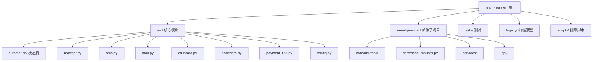

# CLAUDE.md

This file provides guidance to Claude Code (claude.ai/code) when working with code in this repository.

## 项目愿景

Python 自动化项目，通过 Playwright + AdsPower 反检测浏览器完成 OpenAI 账号注册/支付流程。核心架构是**规则优先状态机 + LLM 兜底决策**。

## 架构总览

系统采用分层架构：`main.py`（编排层）调用 `src/`（业务模块层），业务模块层包含状态机引擎、外部服务客户端、工具函数。子项目 `email-provider/` 作为独立邮件服务被 `src/mail.py` 直接导入复用。

核心流程：加载配置 -> 连接 AdsPower 浏览器 -> 注册状态机驱动（入口 -> 认证 -> 邮箱验证 -> 手机验证 -> 首页） -> 可选支付流程（生成支付链接 -> 虚拟卡填写 -> 3DS 验证）。



## 模块索引

| 模块路径 | 语言 | 职责 | 入口文件 |
|---------|------|------|---------|
| `src/automation/` | Python | 状态机引擎、规则决策、LLM 兜底、证据采集 | `runtime.py` |
| `src/providers/` | Python | Provider 抽象层（Browser/Card/Mail ABC + 实现 + Registry） | `__init__.py` |
| `src/db/` | Python | 数据库持久化（SQLModel: Run/RunEvent/Checkpoint/ProviderConfig） | `engine.py` |
| `src/services/` | Python | 业务服务（Config/Event/Auth/Audit/Assistant/Knowledge） | `__init__.py` |
| `src/orchestration/` | Python | 流程编排（PhaseOrchestrator 三阶段 + Checkpoint + warmup） | `orchestrator.py` |
| `src/api/` | Python | FastAPI 控制面（routes/ + worker + security + i18n + deps） | `app.py` |
| `src/templates/` | HTML | 前端模板（HTMX + Tailwind + Alpine.js） | `base.html` |
| `src/` | Python | 业务模块集合（浏览器/接码/邮件/支付） | `__init__.py` |
| `email-provider/` | Python | 独立邮件服务（FastAPI + LuckMail） | `main.py` |
| `legacy/` | Python | 已归档的单文件原型 | - |
| `scripts/` | Python | 手动排障脚本 | - |

## 常用命令

```bash
# 安装依赖
pip install -r requirements.txt
playwright install chromium

# 运行主流程
python main.py

# 启动 Web 控制面
uvicorn src.api.app:app --reload --port 8080

# 测试（pytest.ini 限定只收集 tests/，不会碰 email-provider/tests/）
python -m pytest -q                              # 全量 174 测试
python -m pytest tests/test_api.py -v            # API 集成测试
python -m pytest tests/test_providers.py -v      # Provider 层测试
python -m pytest tests/test_db_models.py -v      # 数据库模型测试
python -m pytest tests/test_services.py -v       # 服务层测试
python -m pytest tests/test_sms.py -v            # 单个测试文件
python -m pytest tests/test_sms.py::TestClass::test_method  # 单个用例

# email-provider 独立测试
cd email-provider && python -m pytest
```

## 主流程 (`main.py`)

入口文件（~2200 行），组装所有模块并驱动注册/支付流程。包含 CSS 选择器常量、`export_success()` 导出 CSV、以及完整的自动化编排逻辑。新代码应优先放入 `src/orchestration/` 而非继续膨胀 `main.py`。

## 根目录历史脚本（不要修改）

仓库根目录留存了一批一次性排障/原型脚本，均**不在测试和文档体系内**，未来变更时请避免误改：

- `debug_checkout.py` / `fill_payment_form.py` / `final_payment.py` / `go_payment.py` / `run_payment_only.py` -- 支付流程一次性脚本
- `retry_new_long.py` / `retry_new_session.py` / `retry_payment.py` -- 重试调试脚本
- `diagnose_mail.py` / `test.py` / `gpt_automation.py` -- 旧入口/排障脚本（`gpt_automation.py` 真正实现已迁至 `legacy/`）

如需新增临时脚本，请放入 `scripts/` 并补充用途说明。

## 核心模块 (`src/`)

- **`config.py`** -- `AppConfig` dataclass，从 `.env` 加载配置并校验必填项；支持按模块分组校验（efuncard/sms/mail/ads/task/llm）
- **`browser.py`** -- AdsPower CDP 连接 + 1024Proxy 代理提取 + preflight 检查
- **`automation/`** -- 状态机核心（详见 `src/automation/CLAUDE.md`）
- **`sms.py`** -- SMS-Activate 接码平台客户端（获取手机号/等待验证码）
- **`mail.py`** -- 邮件服务包装器，直接导入 `email-provider/core/base_mailbox` 复用
- **`efuncard.py`** -- Efuncard 虚拟信用卡客户端（CDK 激活/卡片查询/3DS 轮询），支持1小时内已激活卡复用
- **`nodecard.py`** -- NodeCard 虚拟信用卡客户端（兑换/状态查询/3DS 轮询），作为 Efuncard 的替代方案
- **`payment_link.py`** -- `PaymentLinkGenerator`，支持 Plus/Team 两种计划的 checkout 链接生成
- **`models.py`** -- `CardInfo`/`ProxyInfo`/`SMSOrder` 数据模型（frozen dataclass）
- **`utils.py`** -- `setup_logger()`/`human_delay()` 等工具函数

## 平台化新增模块

- **`src/providers/`** -- Provider 抽象层
  - `browser.py`: `BrowserProvider` ABC + `AdsPowerProvider` 实现
  - `card.py`: `CardProvider` ABC + `EfunCardProvider` / `NodeCardProvider` 实现
  - `mail.py`: `MailProvider` ABC + `HttpMailProvider`（对接 `https://email.feixingqi.shop/` HTTP API）
  - `registry.py`: `ProviderRegistry` 统一注册表
- **`src/db/`** -- 数据库持久化
  - `models.py`: `Run` / `RunEvent` / `Checkpoint` / `ProviderConfig`（SQLModel）
  - `engine.py`: 引擎单例管理，默认 SQLite，支持 PostgreSQL
- **`src/services/`** -- 业务服务
  - `config_service.py`: `ConfigService` 分层配置（.env 基础 + 动态覆盖 + 脱敏快照）+ Provider/MailAccount 持久化
  - `event_service.py`: `EventBroadcaster` 事件写入 DB + SSE 广播
  - `auth_service.py` / `audit_service.py`: 控制台登录与审计日志
  - `assistant_service.py`: 控制台单助手（白名单受控的 preview/commit）
  - `knowledge_service.py`: 手册 + 安全代码全库知识检索
- **`src/orchestration/`** -- 流程编排
  - `orchestrator.py`: `PhaseOrchestrator` 三阶段编排（Registration → TokenExtraction → Payment）+ Checkpoint 断点续跑
  - `selectors.py`: CSS 选择器常量（从 main.py 提取）
  - `handlers.py`: 页面交互函数（从 main.py 提取）
  - `warmup.py`: 浏览器预热与 preflight
- **`src/api/`** -- FastAPI 控制面（`uvicorn src.api.app:app --reload --port 8080`）
  - `app.py`: 应用工厂与中间件装配
  - `routes/`: 端点拆分（任务、配置、Provider、邮件账号、SSE、助手等）
  - `worker.py`: 后台任务执行器（task runner）
  - `security.py`: CSRF + 登录态校验
  - `i18n.py`: 中英文模板渲染辅助
  - `deps.py`: 依赖注入（DB session / current user 等）
- **`src/templates/` + `src/static/`** -- Web Dashboard 前端（HTMX + Tailwind + Alpine.js，无构建步骤）
  - 页面：`/login` / `/help` / `/manual` / `/` / `/tasks` / `/config` / `/providers` / `/mail-accounts`
  - 右下角单助手浮窗：preview → commit 受控执行

## 测试策略

- 框架：pytest（`pytest.ini` 限定 `testpaths = tests`），174 个测试用例
- 测试风格：unittest.TestCase + unittest.mock
- 测试覆盖：
  - `test_providers.py` -- Provider 抽象层（Browser/Card/Mail/Registry）
  - `test_db_models.py` -- 数据库模型 CRUD（in-memory SQLite）
  - `test_services.py` -- ConfigService + EventBroadcaster（含 async 订阅测试）
  - `test_api.py` -- FastAPI 端点集成测试（StaticPool）
  - `test_assistant_intent.py` -- 单助手 intent 识别与白名单边界
  - `test_csrf.py` -- CSRF token 校验
  - `test_events_route.py` -- SSE 路由
  - `test_i18n.py` -- 中英文渲染
  - `test_worker.py` -- 后台任务执行器
  - `test_sms.py` / `test_mail.py` / `test_config.py` -- 原有单元测试
  - `test_automation_runtime.py` / `test_browser.py` / `test_efuncard.py` -- 自动化模块测试
  - `test_main.py` / `test_payment_link.py` -- 主流程和支付测试
- email-provider 有独立测试套件（3个测试文件）

## 关键设计决策

- **状态机优先于 LLM**：`RuleDecisionProvider` 基于 URL + DOM 结构推进流程，`LLMDecisionProvider` 仅在状态歧义/连续失败时从候选动作中选择
- **证据包机制**：每步操作记录到 `artifacts/runs/` 下，便于回放排障
- **可恢复执行**：支持 preflight、clean-start、错误页恢复和人工接管等待
- **外部服务依赖**：AdsPower（浏览器指纹）、SMS-Activate（手机号）、Efuncard/NodeCard（虚拟卡）、LuckMail（邮箱）
- **双卡提供商**：通过 `CARD_PROVIDER` 环境变量切换 efuncard/nodecard
- **三家卡商 + X988 一次性 verify 缓存**：efuncard / nodecard / x988card 三家可选；其中 X988 (cards.779.chat) `POST /api/exchange/verify` 一次性消耗，由 `X988CardProvider` 加 L1 内存 + L2 DB（`card_activations` 表）双层缓存解决，同一卡密在 X988 上**最多 verify 1 次**。运维在 `/cards` 管理（admin 角色，敏感字段全脱敏），手动作废后 X988 不能恢复。EfunCard / NodeCard 已有 query-first API 设计，不需要缓存
- **Provider 抽象**：BrowserProvider/CardProvider/MailProvider ABC + ProviderRegistry，支持运行时热插拔
- **分层配置**：`.env` 基础配置 + 动态覆盖层 + 脱敏快照，新任务获取最新配置
- **三阶段编排**：PhaseOrchestrator（Registration → TokenExtraction → Payment）+ Checkpoint 断点续跑
- **控制面 + 前端**：FastAPI REST API + SSE 实时推送 + HTMX/Alpine.js Dashboard
- **单助手白名单约束**：控制台 AI 助手只允许两类 commit 动作 -- `upsert_provider` 和 `update_config`；高风险流程（注册自动化、CDP、token 提取、支付/绑卡/3DS）只能说明，不能直接 commit；所有 commit 必须基于先前的 `preview_id`，不接受自然语言直接提交
- **邮件链路 latest-only**：任务启动前 preflight `127.0.0.1:8000` 的 `/health`、`/providers`、`supported_session_modes`，缺失 credentialed 能力或 `/credentialed-sessions` 端点会**直接失败**，不再回退到旧 `/sessions` 协议；排障顺序见 README §兼容说明

## 编码规范

- Python 3.11+，使用 dataclass 和 type hints
- 中文日志和注释
- 模块间通过 `src/__init__.py` 和 `src/automation/__init__.py` 显式导出
- frozen dataclass 用于不可变数据模型
- 环境变量通过 `python-dotenv` 加载，配置集中于 `AppConfig`

## 环境变量

参见 `.env.example`。关键分组：
- AdsPower 连接：`ADS_API`, `ADS_API_KEY`
- 虚拟卡：`CARD_PROVIDER`（efuncard/nodecard）, `EFUNCARD_TOKEN`, `NODECARD_*`
- 接码/邮件：`SMS_API_KEY`, `MAIL_REFRESH_TOKEN`, `MAIL_CLIENT_ID`
- LLM 兜底：`LLM_ENABLED`, `LLM_BASE_URL`, `LLM_API_KEY`, `LLM_MODEL`
- 支付控制：`ENABLE_PAYMENT_FLOW`, `PAYMENT_PLAN`, `PAYMENT_LINK_ONLY`, `PAYMENT_LINK_RETURN_MODE`
- 账单回读：`BILLING_COUNTRY` / `BILLING_LINE1` / `BILLING_LINE2` / `BILLING_CITY` / `BILLING_STATE` / `BILLING_POSTAL_CODE`（提交前会回读校验，不一致则中止）
- Team 试用长链接：`AIMIZY_COUNTRY` / `AIMIZY_CURRENCY`（透传给 aimizy 生成 hosted checkout）
- 邮件 provider 路由：`EMAIL_PROVIDER_NAME` + `KNOWN_MAIL_ACCOUNTS_JSON`（推荐显式声明）；legacy 兼容字段 `MAIL_REFRESH_TOKEN` + `MAIL_CLIENT_ID` 仅在 JSON 缺失时为当前任务邮箱动态注入单账号上下文
- 证据/恢复：`RUN_ARTIFACTS_DIR`, `TRACE_ON_FAILURE`, `CLEAN_CONTEXT_MODE`（默认 `reuse_and_clean`）
- 运行时阈值：`MAX_NAVIGATION_RETRIES`, `MAX_EMAIL_ATTEMPTS`, `MAX_PROFILE_RECONNECTS`, `MAX_MANUAL_HANDOFFS`

## AI 使用指引

- 修改状态机逻辑时，优先理解 `AutomationState` 枚举和 `infer_state()` 的推断规则（见 `src/automation/CLAUDE.md`）
- 新增外部服务时，参照 `EfunCard`/`NodeCard` 的客户端模式，并在 `src/providers/` 注册到 `ProviderRegistry`
- `main.py` 体量较大（~2200 行），修改前建议先搜索相关选择器常量和函数；新逻辑优先放入 `src/orchestration/`
- 修改控制台单助手能力时，绝不要绕过 `assistant_service.py` 的白名单（仅 `upsert_provider` / `update_config`），高风险动作必须维持「只说明、不 commit」语义
- 邮件流程报错时，按 README §兼容说明的顺序排障：① 确认 `127.0.0.1:8000` 是最新 `email-provider`；② `/health` + `/providers`；③ `python scripts/manual_mail_check.py`；④ 才看 INBOX/Junk
- 测试使用 mock 隔离外部依赖，不需要真实 API key；`tests/` 与 `email-provider/tests/` 分别独立运行（`pytest.ini` 限定 `testpaths = tests`）

## 变更记录 (Changelog)

| 日期 | 变更内容 | 执行者 |
|------|---------|--------|
| 2026-04-11 | 初始化架构扫描，补充模块结构图、NodeCard 文档、AI 指引等 | Claude Code |
| 2026-04-24 | 同步 main.py 行数（2200）、补 src/api 拆分与新 services、增加根目录历史脚本警告、单助手白名单与邮件 latest-only 设计决策、新增测试文件清单、扩展账单/邮件路由环境变量 | Claude Code |
| 2026-04-26 | 卡预热改为 `mail_accounts(role=pro_warmup)` 号池 + 现场登录刷 token；废弃 `WARMUP_ACCOUNT_POOL` 环境变量；新增 `ConfigService.select_warmup_account()` / `record_warmup_outcome()` 调度（30 分钟冷却 + 连续 3 失败自动禁用）；详见 `docs/architecture/provider-config-flow.md` Ambiguity 2 v2 修复 | Claude Code |
| 2026-04-26 | 新增 `card_activations` 表持久化 X988 卡密激活信息：解决 X988 verify 接口一次性消耗的问题。`X988CardProvider` 加 L1 内存 + L2 DB 双层缓存，同 cdk 在 X988 上**最多 verify 1 次**，跨任务复用同一卡片。新建 `src/services/card_activation_service.py`、`src/api/routes/cards.py`、`/cards` 管理页（admin 角色），支持手动作废 + max_age 防御（`WARMUP_CARD_CACHE_MAX_AGE_DAYS=7`）。EfunCard / NodeCard 不受影响（API 设计已防重） | Claude Code |
